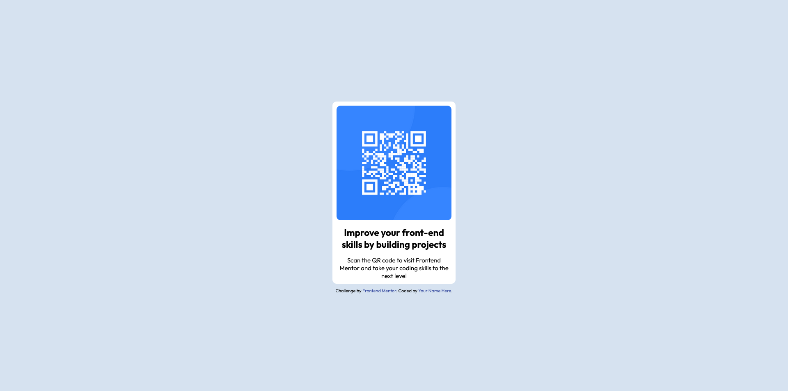

# Frontend Mentor - QR code component solution

This is a solution to the [QR code component challenge on Frontend Mentor](https://www.frontendmentor.io/challenges/qr-code-component-iux_sIO_H). Frontend Mentor challenges help you improve your coding skills by building realistic projects. 

## Table of contents

- [Overview](#overview)
  - [Screenshot](#screenshot)
  - [What I learned](#what-i-learned)

## Overview

### Screenshot



### What I learned

I use display grid, to get the center view of the screen, dan display flex, to tidy up the tags inside the .wrapper class

```css

body{
  margin: 0;
  display: grid;
  place-content: center;
  height: 100vh;
  background-color: var(--light-gray);
}

.wrapper{
    width: 300px;
    padding: 10px;
    margin: 10px;
    background-color: var(--white);
    border-radius: 10px;
    display: flex;
    flex-direction: column;
    gap: 15px;
    text-align: center;
}

```

"# qr-code-component-main" 
